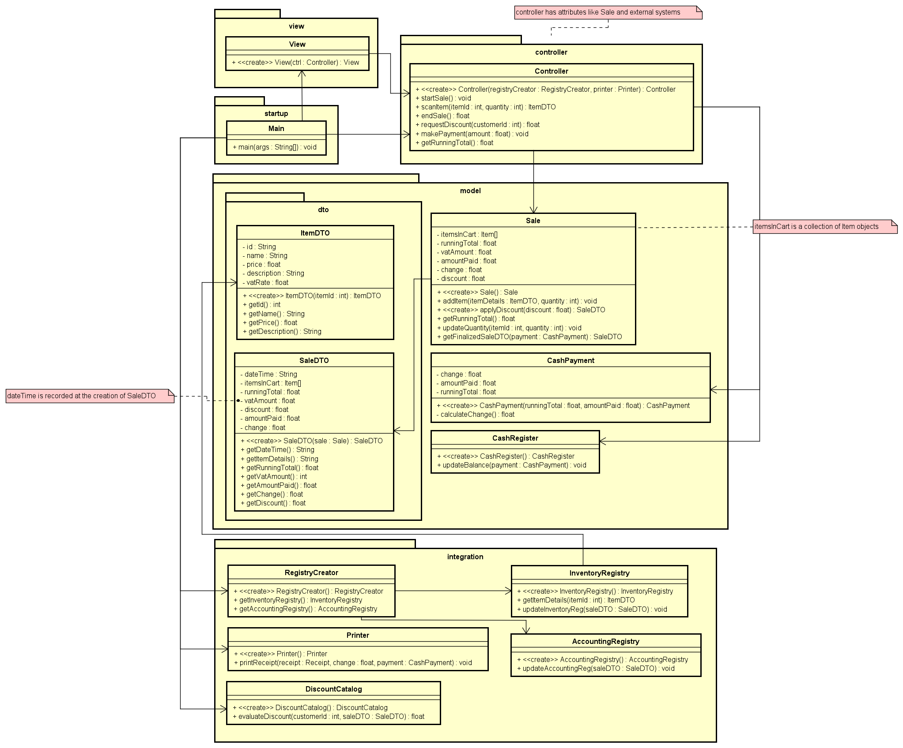

# Cashier System

A Java-based cashier system implementing object-oriented design principles for retail store transactions.

## Project Overview

This project is an implementation of a cashier/point-of-sale system that handles sales transactions in a retail environment. The system follows the Model-View-Controller (MVC) pattern and emphasizes high cohesion, low coupling, and proper encapsulation.

### Features

- Start and manage sales transactions
- Scan items using identifiers
- Calculate running totals and VAT
- Process cash payments
- Generate receipts
- Update inventory and accounting systems
- Alternative flow for handling repeated items

## Architecture

The system is organized into six main packages:

- **Controller**: Coordinates operations between the view and model
- **Model**: Contains the core business logic and domain objects
- **Integration**: Handles external system interactions
- **DTO**: Provides data transfer objects for communication between layers
- **View**: Simulates user interactions with the system
- **Startup**: Initializes the application

## Getting Started

### Prerequisites

- Java JDK 11 or higher
- Maven

### Installation

1. Clone the repository:
   ```
   git clone https://github.com/FelixSivars/IV1350-Cashier-System.git
   ```

2. Navigate to the project directory:
   ```
   cd IV1350-Cashier-System
   ```

3. Build the project:
   ```
   mvn clean install
   ```

### Running the Application

Execute the main class to start the application:

```
mvn exec:java -Dexec.mainClass="se.kth.iv1350.cashiersystem.startup.Main"
```

## Sample Output

The application simulates a sales process with the following output:

```
A new sale has been started.

Add 1 item(s) with item id abc123
Item ID: abc123
Item name: BigWheel Oatmeal
Item cost: 29.9 SEK
VAT: 6 %
Item description: BigWheel Oatmeal 500 g, whole grain oats, high fiber, gluten free
 
Total cost (incl VAT): 29.9 SEK
Total VAT: 1.79 SEK

...

----------------- Begin receipt -----------------
...
------------------ End receipt ------------------
Change to give to customer: 25.3 SEK
```

## Testing

The project includes comprehensive unit tests for all main components:

```
mvn test
```

## Class Diagram



## Design Principles

This project follows several key object-oriented design principles:

- **High Cohesion**: Each class has a clear, focused responsibility
- **Low Coupling**: Dependencies between components are minimized
- **Proper Encapsulation**: Internal details are hidden behind well-defined interfaces
- **DTOs for Data Transfer**: Clear separation between layers using Data Transfer Objects
- **MVC Architecture**: Separation of concerns between Model, View, and Controller

## Contributors

- [Felix Sivars](https://github.com/FelixSivars)
- [Kai Nguyen](https://github.com/kaidev04)
- [Linda Zhang](https://github.com/jenny78930)

## License

This project is created for educational purposes as part of the IV1350 Object-Oriented Design course at KTH Royal Institute of Technology.